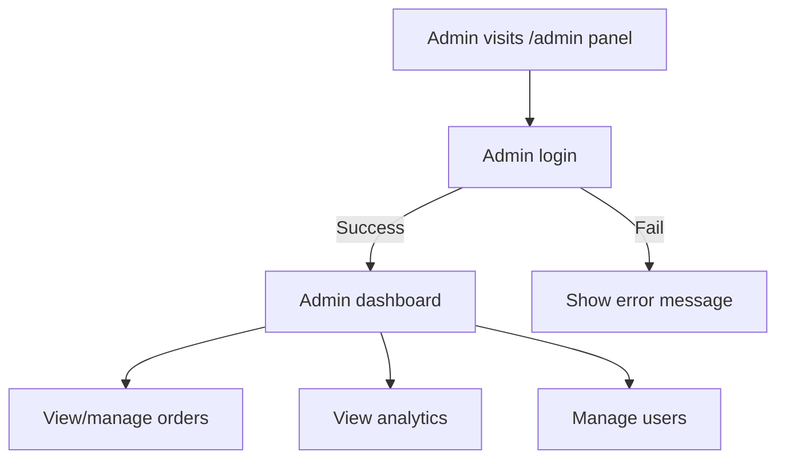

# Meesho AI Shopping Assistant

## Sub-theme
AI-powered Shopping Assistant with Multi-language Support, Order Tracking, and Admin Management

---

## Project Overview
A full-stack conversational shopping assistant for Meesho, featuring:
- Multi-language chatbot (English, Hindi, Gujarati, Telugu, etc.)
- Product search, recommendations, cart, and order tracking
- Secure admin dashboard for order management
- Modern, responsive UI

---

## Open-Source Attribution
| Library/Tool         | Version | License   | Role in Project         | Source Link |
|----------------------|---------|-----------|-------------------------|-------------|
| React                | 18.x    | MIT       | Frontend UI             | https://github.com/facebook/react |
| Node.js              | 18.x    | MIT       | Backend runtime         | https://github.com/nodejs/node |
| Express              | 4.x     | MIT       | Backend API             | https://github.com/expressjs/express |
| Mongoose             | 7.x     | MIT       | MongoDB ODM             | https://github.com/Automattic/mongoose |
| MongoDB Atlas        | Cloud   | SSPL      | Database                | https://www.mongodb.com/atlas |
| Dialogflow           | Cloud   | Proprietary| NLP/Intent Detection    | https://dialogflow.cloud.google.com/ |
| Axios                | 1.x     | MIT       | HTTP Requests           | https://github.com/axios/axios |
| bcryptjs             | 2.x     | MIT       | Password Hashing        | https://github.com/dcodeIO/bcrypt.js |
| nodemon              | 3.x     | MIT       | Dev Server              | https://github.com/remy/nodemon |
| dotenv               | 16.x    | BSD-2     | Env Loader              | https://github.com/motdotla/dotenv |
| react-router-dom     | 6.x     | MIT       | Routing                 | https://github.com/remix-run/react-router |
| Material Icons       | Latest  | Apache 2.0| UI Icons                | https://fonts.google.com/icons |

---

## Setup Guide

### 1. Clone the repository
```sh
git clone <repo-url>
cd shopping_assistant
```

### 2. Install dependencies
```sh
cd backend && npm install
cd ../frontend && npm install
```

### 3. Configure environment variables
- Copy `.env.example` to `.env` in both `backend` and `frontend` (if needed)
- Add your MongoDB Atlas URI and other secrets

### 4. Seed admin user
```sh
node backend/scripts/seedAdmin.js
```

### 5. Start servers
```sh
cd backend && npm run dev
cd ../frontend && npm start
```

### 6. Access the app
- Frontend: `http://localhost:3000`
- Backend API: `http://localhost:7654`
- Admin Panel: `http://localhost:3000/admin`

---

## Prototype Showcase
- **Live Demo:** [Add your deployed app link]
- **Source Code:** [GitHub repo link]
- **Screenshots:** Add screenshots of chat window, order tracking, admin dashboard, etc.

---

## Detailed Project Description

### Features & Flow
- **Multi-language Chatbot:** Uses Dialogflow for intent detection and LibreTranslate for real-time translation. Supports multiple Indian languages.
- **Product Search & Recommendations:** ML-powered recommendations, product cards with images, add-to-cart, and view details.
- **Order Tracking:** Track order status.
- **Admin Panel:** Secure login (bcrypt hashed passwords), order management dashboard.
- **Authentication:** JWT-based user and admin authentication.
- **Modern UI:** React, Material Icons, responsive design.

### System Architecture
- **Frontend:** React SPA, communicates with backend via REST APIs.
- **Backend:** Node.js/Express, MongoDB Atlas, Dialogflow webhook integration.
- **Database:** MongoDB Atlas for users, products, orders, admin.


### Flowcharts

#### User Journey
```mermaid
flowchart TD
    A[User interacts with chatbot] --> B{Intent detected}
    B -->|Product search| C[Backend fetches products]
    B -->|Order tracking| D[Backend fetches order]
    B -->|Recommendations| E[Backend fetches suggestions]
    C --> F[Product cards sent to chat]
    D --> G[Order details (with images) sent to chat]
    E --> H[Recommendations sent to chat]
    F --> I[User adds to cart]
    G --> J[User views order status/images]
    H --> K[User explores recommendations]
    I --> L[User places order]
    L --> D
```

#### Admin Flow (Separate from Chat)


---

## Additional Notes
- All sensitive files (`.env`) are gitignored
- All open-source libraries are properly attributed
- No proprietary code except Dialogflow (free tier)
- Sub-theme: AI-powered Shopping Assistant


